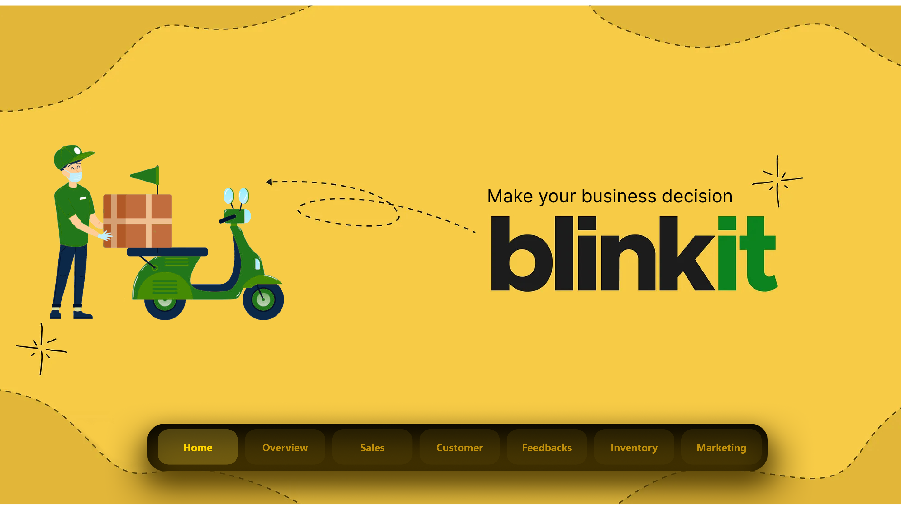
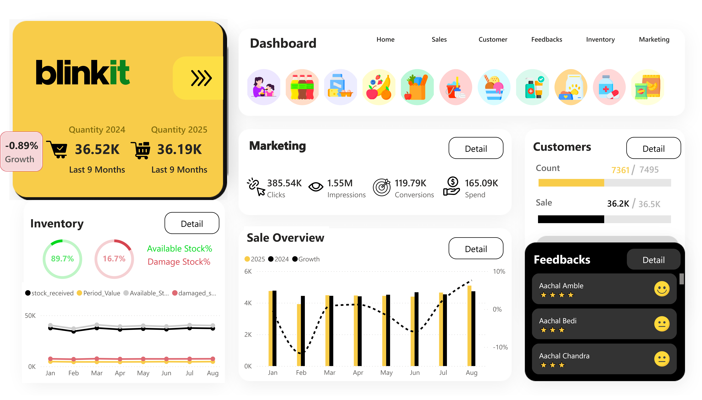
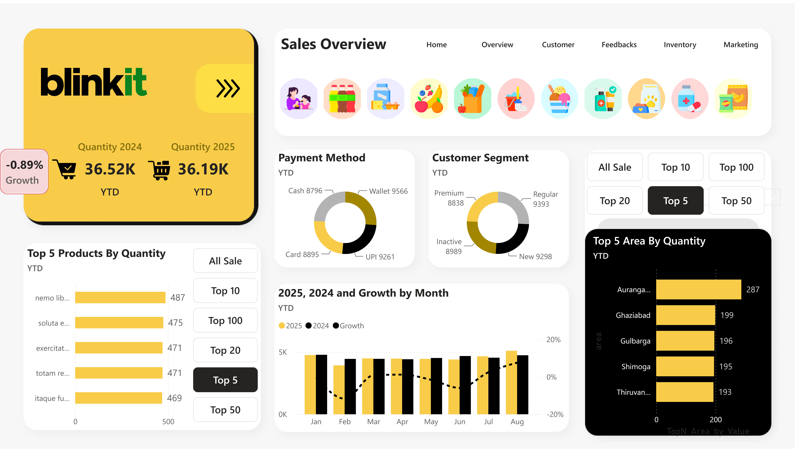
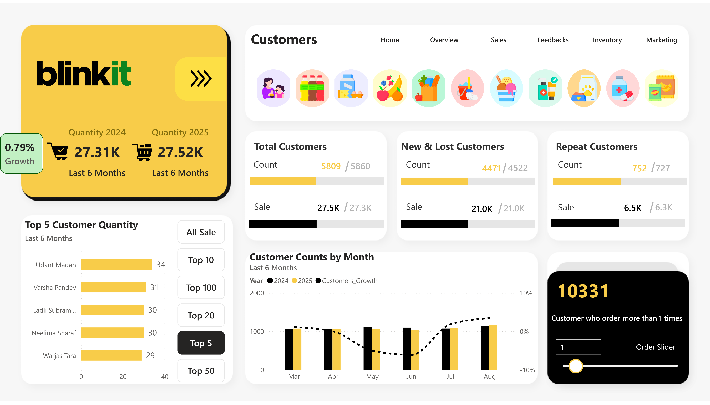
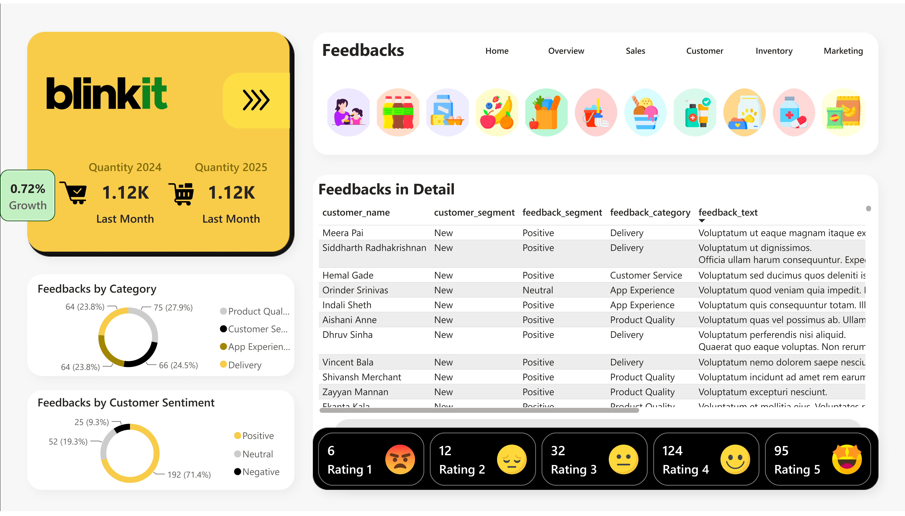
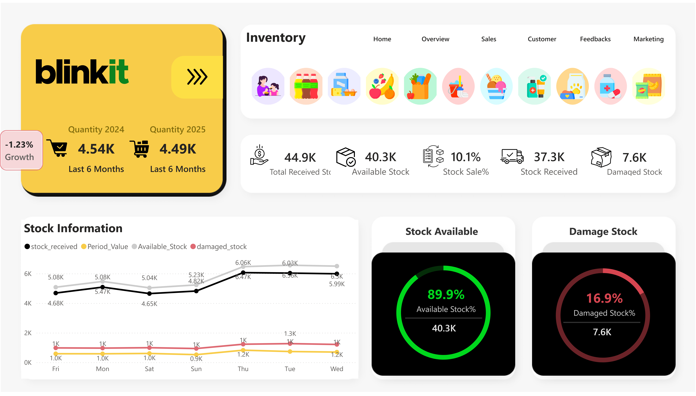
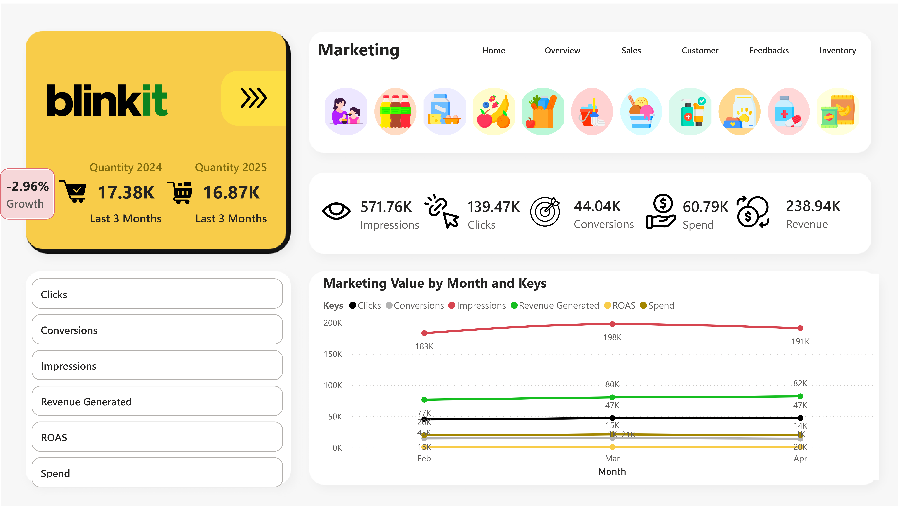
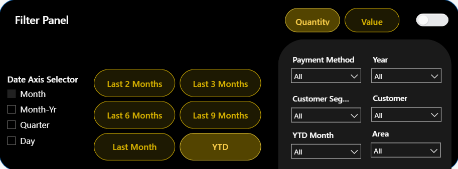

# 🛒 Blinkit Power BI Dashboard

## 📌 Project Overview

The **Blinkit Power BI Dashboard** is an interactive business dashboard that helps analyze Blinkit’s **sales, customers, inventory, feedback, and marketing performance** in one place.

It uses **MySQL, Power Query, Power BI, and DAX** to transform business data into easy-to-understand charts, KPIs, and interactive reports.

Users can apply filters, compare different time periods, view **YTD performance**, analyze **Top-N products/customers/areas**, and use the **Dynamic System Year Toggle** to automatically update year-based analysis.

The dashboard helps answer simple business questions like:

- 💰 How are sales performing?
- 👥 How are customers changing?
- 📦 How much stock is available or damaged?
- 💬 What are customers saying?
- 📢 How are marketing activities performing?

**In simple words:**

> This project converts Blinkit business data into an interactive Power BI dashboard so users can quickly understand business performance and make data-driven decisions.

---

## 🎯 Project Objectives

The dashboard is designed to:

- Monitor important business KPIs
- Analyze sales performance and trends
- Compare current and previous-year performance
- Track Year-to-Date (YTD) performance
- Understand customer purchasing behavior
- Analyze new, lost and repeat customers
- Monitor customer feedback and ratings
- Track available, received and damaged stock
- Analyze marketing performance
- Identify top-performing products, customers and areas
- Provide dynamic filtering and time-based analysis
- Automatically update year-based analysis using the system year

---

# 🛠️ Tools & Technologies

| Technology | Purpose |
|------------|---------|
| **Microsoft Power BI** | Dashboard development and data visualization |
| **MySQL** | Data storage, querying and data import |
| **DAX** | Measures, KPIs, YTD and business calculations |
| **Power Query** | Data cleaning and transformation |
| **Data Modeling** | Creating relationships between tables |
| **Figma** | Dashboard UI/UX design and layout planning |
| **GitHub** | Version control and project documentation |
| **Netlify** | Live dashboard deployment |

### 🔧 Technology Stack

- **Power BI** — Interactive dashboard development
- **MySQL** — Data source and SQL querying
- **DAX** — Business calculations and dynamic measures
- **Power Query** — Data cleaning and transformation
- **Data Modeling** — Relationships and analytical structure
- **Figma** — Dashboard UI/UX design
- **GitHub** — Repository and documentation
- **Netlify** — Live deployment

---

# 📊 Dashboard Pages

The dashboard contains **7 main pages**:

```text
🏠 Home
│
├── 📈 Overview
├── 💰 Sales
├── 👥 Customers
├── 💬 Feedbacks
├── 📦 Inventory
└── 📢 Marketing
```

---

# 🏠 1. Home

The **Home page** is the main navigation page of the dashboard.

It provides quick access to all major sections of the report.

### Main Sections

- Overview
- Sales
- Customers
- Feedbacks
- Inventory
- Marketing

### Purpose

The Home page provides a simple and user-friendly entry point to the complete dashboard.

<p align="center">
  
</p>

---

# 📈 2. Overview

The **Overview page** provides a quick summary of overall business performance.

It combines important information from different business areas into one view.

### 💰 Sales

The page provides:

- Current-period sales
- Previous-period sales
- Growth %
- Monthly sales trends
- YTD sales performance

### 👥 Customers

The customer summary includes:

- Customer count
- Previous-period customer count
- Customer growth
- Customer sales contribution

### 📦 Inventory

The inventory summary includes:

- Available Stock %
- Damaged Stock %
- Stock Received
- Available Stock
- Stock Sales %

### 📢 Marketing

The page provides a quick summary of important marketing metrics.

### 💬 Feedbacks

A quick view of customer feedback and ratings is also available.

### 🎯 Purpose

The Overview page answers:

> **"How is the business performing overall?"**

<p align="center">
  
</p>

---

# 💰 3. Sales

The **Sales page** provides detailed analysis of sales performance.

### 💳 Payment Method

Sales are analyzed using different payment methods.

This helps understand customer payment preferences.

### 👥 Customer Segment

Sales performance can be analyzed across different customer segments.

### 🏆 Top Products

The dashboard provides dynamic Top-N product analysis.

Available selections include:

- All Sales
- Top 5
- Top 10
- Top 20
- Top 50
- Top 100

### 📍 Top Areas

Top-performing areas can also be analyzed using dynamic Top-N selection.

### 📅 Monthly Sales

Monthly sales are compared across different years.

The analysis includes:

- Current Year
- Previous Year
- Growth %

### 📆 YTD Sales

**Year-to-Date (YTD)** analysis tracks cumulative sales performance from the beginning of the selected year up to the selected period.

### 🎯 Purpose

The Sales page answers:

> **"What is selling, where is it selling, and how is sales performance changing?"**

<p align="center">
  
</p>

---

# 👥 4. Customers

The **Customers page** focuses on customer growth and purchasing behavior.

### 👤 Total Customers

Shows the total number of customers and comparison with the previous period.

### 🆕 New Customers

Identifies newly acquired customers.

### ❌ Lost Customers

Identifies customers who are no longer active.

### 🔁 Repeat Customers

Tracks customers who place multiple orders.

### 🏆 Top Customers

Dynamic Top-N analysis helps identify customers with the highest purchase quantity.

### 📅 Monthly Customer Trend

Customer counts are compared month-by-month across years.

### 📆 YTD Customer Analysis

YTD analysis tracks cumulative customer performance during the selected year.

### 🎯 Purpose

The Customers page answers:

> **"How is the customer base changing and how many customers are coming back?"**

<p align="center">
  
</p>

---

# 💬 5. Feedbacks

The **Feedbacks page** provides detailed analysis of customer feedback.

### 🗂️ Feedback Categories

Feedback is categorized into different business areas.

### 😊 Customer Sentiment

Feedback is analyzed using:

- Positive
- Neutral
- Negative

### ⭐ Customer Ratings

The dashboard provides rating-wise analysis.

### 📋 Feedback Details

A detailed table provides:

- Customer Name
- Customer Segment
- Feedback Segment
- Feedback Category
- Feedback Text
- Rating
- Star Rating

### 🎯 Purpose

The Feedback page answers:

> **"What are customers saying about the business?"**

<p align="center">
  
</p>

---

# 📦 6. Inventory

The **Inventory page** focuses on stock management and inventory health.

### 📊 Main KPIs

- Period Inventory Value
- Stock Received
- Available Stock
- Damaged Stock
- Stock Sales %

### 🟢 Available Stock

Shows the amount and percentage of stock currently available.

### 🔴 Damaged Stock

Shows damaged stock quantity and its percentage.

### 📈 Stock Information

The dashboard tracks:

- Stock Received
- Period Inventory Value
- Available Stock
- Damaged Stock

over time.

### 📆 YTD Inventory Analysis

YTD analysis can be used to monitor cumulative inventory performance during the selected year.

### 🎯 Purpose

The Inventory page answers:

> **"How much stock is available, received, sold and damaged?"**

<p align="center">
  
</p>

---

# 📢 7. Marketing

The **Marketing page** provides detailed marketing performance analysis.

### 📊 Key Metrics

- 👁️ Impressions
- 🖱️ Clicks
- 🎯 Conversions
- 💰 Marketing Spend
- 💵 Revenue
- 📈 ROAS

### 📅 Monthly Marketing Analysis

Marketing metrics can be analyzed month-by-month.

The dashboard provides analysis of:

- Impressions
- Clicks
- Conversions
- Spend
- Revenue
- ROAS

### 📆 YTD Marketing Analysis

YTD analysis helps track cumulative marketing performance from the beginning of the year to the selected period.

### 🎯 Purpose

The Marketing page answers:

> **"How are marketing activities performing and what results are they generating?"**

<p align="center">
  
</p>

---

# 🎛️ Filter Panel

The dashboard includes a dedicated **Filter Panel** that provides centralized control over the report.

<p align="center">
  
</p>

The Filter Panel allows users to dynamically control the analysis.

---

## 📊 Quantity / Value Toggle

Users can switch between:

- **Quantity** — Analyze performance based on quantity.
- **Value** — Analyze performance based on business value.

This allows the dashboard to support different analytical requirements.

---

## 📅 Date Axis Selector

Users can dynamically change the date granularity.

Available options:

- Month
- Month-Yr
- Quarter
- Day

This allows the same metric to be analyzed at different time levels.

---

## ⏱️ Period Selection

Quick period buttons are available:

- Last Month
- Last 2 Months
- Last 3 Months
- Last 6 Months
- Last 9 Months
- YTD

These buttons allow users to quickly change the analysis period.

---

## 💳 Payment Method Filter

Users can filter the dashboard according to the selected payment method.

---

## 📆 Year Filter

Users can select the required year for analysis.

This helps compare and analyze business performance across different years.

---

## 👥 Customer Segment Filter

Users can filter the dashboard according to customer segment.

---

## 👤 Customer Filter

Users can select an individual customer and analyze their performance.

---

## 📅 YTD Month Filter

The **YTD Month** filter allows users to select a specific month for Year-to-Date analysis.

For example:

```text
January → YTD January
March   → YTD January to March
June    → YTD January to June
```

---

## 📍 Area Filter

Users can filter the dashboard according to a specific business area.

---

# 🔄 Dynamic System Year Toggle

The dashboard includes a **Dynamic System Year Toggle** that allows the user to switch between a predefined analysis year and the current system year.

### ⚙️ How It Works

```text
OFF → Uses the predefined/default analysis year

ON  → Uses the current system year dynamically
```

When the toggle is enabled, the dashboard identifies the current year from the system date and updates the relevant year-based analysis.

### 📅 Example

If the default analysis year is **2024**:

```text
System Year Toggle → OFF
Analysis Year → 2024
```

When the toggle is enabled:

```text
System Year Toggle → ON
Analysis Year → Current System Year
```

### 🎯 Benefits

- 🔄 Automatic year updating
- 📅 Reduces manual year changes
- 📊 Keeps year-based analysis dynamic
- ⚡ Reduces dashboard maintenance
- 🚀 Makes the dashboard more future-ready

---

# 🎛️ Interactive Features

The dashboard contains several interactive features.

### 🔄 Dynamic System Year

Users can switch between:

- Default analysis year
- Current system year

This reduces manual year maintenance.

### 🎯 Dynamic Top-N Analysis

Users can dynamically select:

- Top 5
- Top 10
- Top 20
- Top 50
- Top 100
- All Sales

### 📆 Dynamic Time Periods

Users can select:

- Last Month
- Last 2 Months
- Last 3 Months
- Last 6 Months
- Last 9 Months
- YTD

### 📊 Dynamic Date Axis

Users can change the analysis level between:

- Month
- Month-Yr
- Quarter
- Day

### 🎚️ Quantity / Value Toggle

Users can switch between quantity-based and value-based analysis.

### 🔎 Centralized Filters

The Filter Panel provides filters for:

- Year
- Payment Method
- Customer
- Customer Segment
- YTD Month
- Area

---

# 📆 YTD Analysis

**Year-to-Date (YTD)** is an important analytical feature of the dashboard.

YTD calculates cumulative performance from the beginning of the selected year up to the selected date or month.

### YTD is used for:

- 💰 Sales
- 👥 Customers
- 📦 Inventory
- 📢 Marketing

### Example

If the selected YTD month is **June**:

```text
YTD = January + February + March + April + May + June
```

This provides a clear view of business performance so far in the year.

---

# 🧮 DAX & Data Analysis

DAX is used to create dynamic calculations and business measures.

### Key DAX Concepts

- Measures
- Variables
- CALCULATE
- FILTER
- SUM
- DISTINCTCOUNT
- SELECTEDVALUE
- MAX
- IF
- SWITCH
- SUMMARIZE
- RANKX
- Time Intelligence
- YTD
- Growth %
- Dynamic Top-N
- Dynamic Year Selection

### 🔄 Dynamic System Year Logic

The dashboard uses DAX logic to determine whether the user wants to use:

```text
Default Year
     OR
System Year
```

This makes the report more dynamic and reduces manual maintenance.

---

# 🔄 Data Workflow

```text
                MySQL
                  │
                  ▼
          Data Extraction
                  │
                  ▼
            Power Query
                  │
                  ▼
        Data Transformation
                  │
                  ▼
           Data Modeling
                  │
                  ▼
                DAX
                  │
                  ▼
           Power BI Report
                  │
                  ▼
        Interactive Dashboard
                  │
                  ▼
              Netlify
                  │
                  ▼
           Live Dashboard
```

---

# 📐 Dashboard Design

The dashboard UI and layout were planned using **Figma** before implementation in Power BI.

The design focuses on:

- Clean layout
- Consistent spacing
- Easy navigation
- Clear KPI presentation
- Consistent color palette
- User-friendly filtering
- Interactive navigation
- Business-focused visualization

---

# 💡 Business Insights

The dashboard helps answer important business questions.

### 💰 Sales

- Which products are performing best?
- Which areas generate the highest quantity?
- How are sales changing month-by-month?
- How is YTD sales progressing?
- How does the current year compare with the previous year?

### 👥 Customers

- How many customers are active?
- How many new customers were acquired?
- How many customers were lost?
- How many customers are repeat buyers?
- How is customer performance changing?

### 💬 Feedback

- What are customers saying?
- Which feedback category receives the most feedback?
- What is the overall sentiment?
- How are ratings distributed?

### 📦 Inventory

- How much stock is available?
- How much stock was received?
- How much stock is damaged?
- What percentage of stock is available?
- How is inventory changing over time?

### 📢 Marketing

- How many impressions are generated?
- How many clicks are received?
- How many conversions are generated?
- How much is spent?
- How much revenue is generated?
- What is the ROAS?

---

# 📁 Repository Structure

```text
Blinkit-PowerBI-Dashboard/
│
├── README.md
├── Blinkit.pbix
│
└── assets/
    └── Images/
        └── Dashboard/
            ├── Home.png
            ├── Overview.png
            ├── Sales.png
            ├── Customers.png
            ├── Feedbacks.png
            ├── Inventory.png
            ├── Marketing.png
            └── Filter Panel.png
```

> **Note:** Keep the image file names and folder paths exactly the same as used in this README.

---

# 🚀 Live Dashboard

<p align="center">
  <a href="https://blinkit-dashboards.netlify.app/">
    🌐 <b>View Live Dashboard</b>
  </a>
</p>

---

# 🔗 Connect With Me

<p align="center">
  <a href="https://github.com/Arpit12890">💻 GitHub</a> •
  <a href="https://www.linkedin.com/in/arpit-gupta-014819252">🔗 LinkedIn</a> •
  <a href="mailto:arpitgupta205001@gmail.com">📧 Gmail</a>
</p>

---
